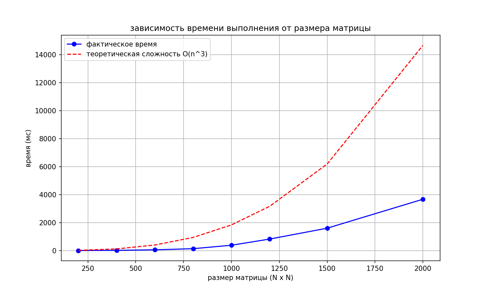

# Лабораторная работа №1. Последовательное умножение матриц

## Задание
* Написать программу на языке C/C++ для перемножения двух квадратных матриц.
* Исходные данные: файлы, содержащие значения исходных матриц.
* Выходные данные: файл со значениями результирующей матрицы, время выполнения, объем задачи.
* Обязательна автоматизированная верификация результатов вычислений с помощью Python (NumPy).

## Алгоритм
В проекте реализована оптимизированная схема перестановки циклов **i-k-j**. В отличие от стандартного подхода (i-j-k), этот метод значительно повышает эффективность работы с кэш-памятью процессора.

**Преимущества порядка i-k-j:**
* **Локальность данных:** Обращение к элементам матрицы B происходит последовательно по строке. Это минимизирует промахи кэша.
* **Скорость:** Линейный доступ к памяти позволяет процессору эффективно задействовать аппаратные механизмы предвыборки данных.

## Результаты тестирования
Замеры времени выполнения последовательной реализации на C++ (с компиляцией `-O3`):

| Размер матрицы (N x N) | Время C++ (мс) |
|------------------------|----------------|
| 200 x 200              | 1.89           |
| 400 x 400              | 14.63          |
| 600 x 600              | 52.67          |
| 800 x 800              | 132.93         |
| 1000 x 1000            | 379.43         |
| 1200 x 1200            | 822.18         |
| 1500 x 1500            | 1598.54        |
| 2000 x 2000            | 3667.02        |

## Анализ
* **Эффективность:** Благодаря схеме i-k-j и оптимизации компилятора, время выполнения растёт плавно, без резких скачков.
* **Масштабируемость:** Рост времени вычислений строго соответствует теоретической сложности алгоритма $O(N^3)$.



## Верификация и контроль точности
Для проверки корректности вычислений используется автоматизированный Python-скрипт `gen_check.py`:
* **Эталон:** Результаты C++ сопоставляются с результатом функции `numpy.dot()`.
* **Точность:** Сравнение результатов происходит через функцию `numpy.allclose()` с абсолютным допуском `atol=1e-3`.
* **Автоматизация:** Скрипт самостоятельно генерирует случайные матрицы, записывает их в файлы, вызывает C++ программу и выносит вердикт о корректности.

## Инструкция по запуску
1. **Скомпилировать C++ код:**
   ```bash
   g++ -O3 src/main.cpp -o main.exe
2. **Запустить автоматическую верификацию:**
   ```bash
   python scripts/gen_check.py
3. **Запустить бенчмарк и построение графиков:**
   ```bash
   python scripts/bench.py