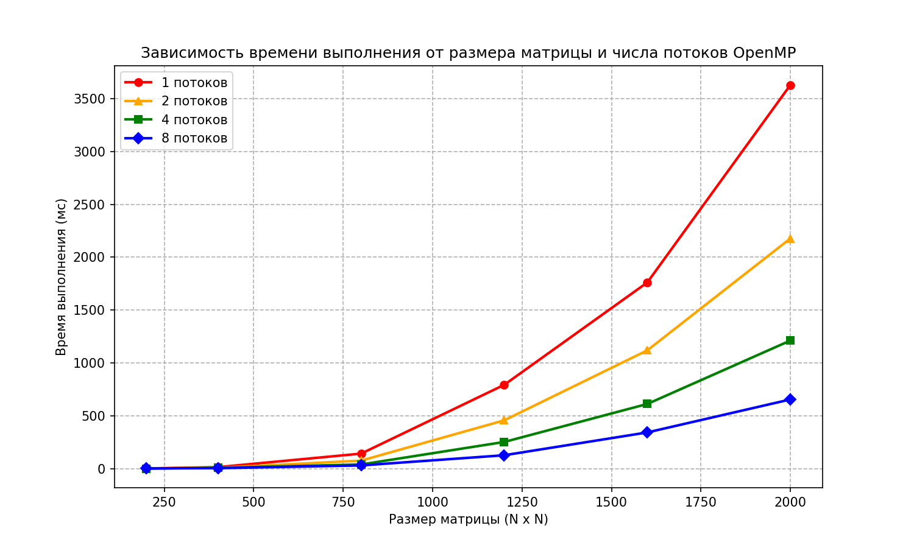

# Лабораторная работа №2. Параллельное умножение матриц с использованием OpenMP

## Задание
* Модифицировать программу из лабораторной работы №1 для параллельной работы по технологии OpenMP.
* Провести серию экспериментов с разным количеством потоков (1, 2, 4, 8) и разными размерами матриц (200, 400, 800, 1200, 1600, 2000).
* Построить графики зависимости времени выполнения от объема задачи и числа потоков.

## Алгоритмические особенности распараллеливания
В качестве основы взят оптимизированный алгоритм умножения матриц с обходом **i-k-j** из Л/Р №1.

Распараллеливание реализовано с помощью директивы компилятора OpenMP:
```cpp
for (int i = 0; i < N; ++i) { ... }
```

* **Разделение работы:** Внешний цикл по строкам матрицы `A` (индекс `i`) статически распределяется между доступными потоками процессора. Каждый поток обрабатывает свою независимую порцию строк.
* **Общая память :** Матрицы `A`, `B` и `C` находятся в общей памяти и доступны всем потокам на чтение. Запись в ячейки `C[i * N + j]` выполняется потоками независимо, так как индекс строки `i` уникален для каждого потока (исключено состояние гонки).

## Результаты тестирования
Время выполнения параллельной реализации на C++ с флагом `-fopenmp` (в миллисекундах):

| Размер матрицы | 1 поток (мс) | 2 потока (мс) | 4 потока (мс) | 8 потоков (мс) |
|----------------|--------------|---------------|---------------|----------------|
| 200 x 200      | 1.84         | 1.63          | 1.17          | 2.07           |
| 400 x 400      | 14.52        | 8.60          | 8.07          | 4.80           |
| 800 x 800      | 142.23       | 76.07         | 39.64         | 30.53          |
| 1200 x 1200    | 792.69       | 457.04        | 252.55        | 126.84         |
| 1600 x 1600    | 1761.00      | 1118.92       | 612.01        | 342.71         |
| 2000 x 2000    | 3629.30      | 2177.17       | 1211.81       | 654.60         |

## Анализ производительности и ускорения
На основе полученных данных рассчитаем коэффициент ускорения $S_p = T_1 / T_p$ для максимального размера матрицы (2000 x 2000):
* Ускорение на 2 потоках: $S_2 = 3629.30 / 2177.17 \approx 1.67$
* Ускорение на 4 потоках: $S_4 = 3629.30 / 1211.81 \approx 3.00$
* Ускорение на 8 потоках: $S_8 = 3629.30 / 654.60 \approx 5.54$

**Выводы:**
1. **Эффективность масштабирования:** Начиная с размера матрицы 400x400 наблюдается стабильный рост производительности при увеличении числа потоков. На размере 2000x2000 использование 8 потоков позволило сократить время вычислений более чем в 5.5 раз.
2. **Влияние накладных расходов (Overhead):** На малых размерностях (200x200) использование 8 потоков неэффективно (время выросло до 2.07 мс) из-за накладных расходов ОС на создание и синхронизацию потоков OpenMP, которые превышают само время вычислений.



## Верификация и контроль точности
Для проверки корректности используется Python-скрипт `gen_check.py`:
* Сопоставление результатов C++ с эталоном `numpy.dot()`.
* Точность сравнения: `numpy.allclose(..., atol=1e-3)`.

## Инструкция по запуску
1. **Скомпилировать программу с поддержкой OpenMP:**
   ```bash
   g++ -O3 -fopenmp src/main.cpp -o main.exe
   ```
2. **Запустить автоматическую верификацию результатов:**
   ```bash
   python scripts/gen_check.py
   ```
3. **Запустить нагрузочный тест бенчмарка:**
   ```bash
   python scripts/bench.py
   ```