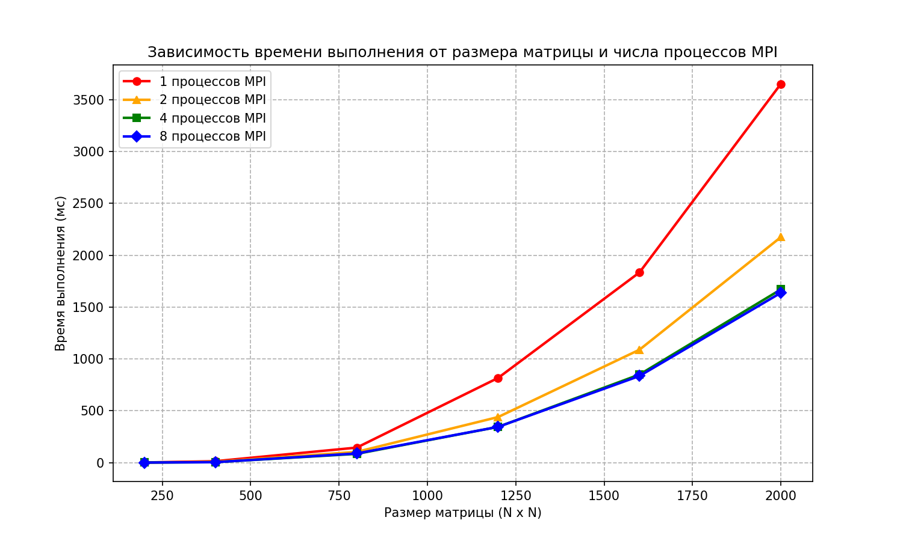

# Лабораторная работа №3. Параллельное умножение матриц с использованием MPI

## Задание
* Модифицировать программу из лабораторной работы №1 для параллельной работы по технологии MPI.
* Провести серию экспериментов с разным количеством процессов (1, 2, 4, 8) и разными размерами матриц (200, 400, 800, 1200, 1600, 2000).
* Построить графики зависимости времени выполнения от объема задачи и числа процессов MPI.

## Алгоритмические особенности распределенных вычислений
Для реализации распределенного умножения матриц использована модель передачи сообщений MPI:

1. **Инициализация и распределение ролей:**
   * Процесс с рангом `0` (Root) выступает в роли главного: считывает матрицы $A$ и $B$ из файлов, делит работу и собирает результат.
   * Остальные процессы (ранги > 0) выступают в роли вычислительных узлов.

2. **Передача данных:**
   * **`MPI_Bcast`** — матрица $B$ транслируется целиком с главного процесса на все вычислительные узлы (размер $N \times N$).
   * **`MPI_Scatter`** — матрица $A$ делится на равные горизонтальные полосы (размер блока `(N / size) * N`) и раздаётся каждому процессу.
   
3. **Локальные вычисления:**
   * Каждый процесс умножает полученную полосу строк матрицы $A$ на всю матрицу $B$, используя оптимизированный алгоритм обхода **i-k-j** из Л/Р №1.

4. **Сбор результатов:**
   * **`MPI_Gather`** — главный процесс собирает вычисленные локальные части матрицы $C$ от всех процессов в единую полную матрицу и записывает её в файл.

## Результаты тестирования
Время выполнения параллельной MPI-реализации на C++ (в миллисекундах):

| Размер матрицы | 1 процесс (мс) | 2 процесса (мс) | 4 процесса (мс) | 8 процессов (мс) |
|----------------|----------------|-----------------|-----------------|------------------|
| 200 x 200      | 1.91           | 1.36            | 1.36            | 1.18             |
| 400 x 400      | 14.30          | 8.04            | 4.99            | 4.82             |
| 800 x 800      | 145.39         | 104.26          | 85.05           | 88.89            |
| 1200 x 1200    | 817.46         | 440.10          | 345.07          | 345.48           |
| 1600 x 1600    | 1834.97        | 1089.60         | 850.10          | 836.14           |
| 2000 x 2000    | 3653.47        | 2175.41         | 1670.81         | 1638.38          |

## Анализ производительности и эффективности
Рассчитаем ускорение алгоритма $S_p = T_1 / T_p$ для матрицы максимального размера (2000 x 2000):
* Ускорение на 2 процессах: $S_2 = 3653.47 / 2175.41 \approx 1.68$
* Ускорение на 4 процессах: $S_4 = 3653.47 / 1670.81 \approx 2.19$
* Ускорение на 8 процессах: $S_8 = 3653.47 / 1638.38 \approx 2.23$

**Выводы и сравнение с OpenMP:**
1. **Эффективность параллелизма:** MPI показывает стабильное ускорение на больших размерах матриц при переходе от 1 к 4 процессам.
2. **Влияние коммуникационных расходов (Communication Overhead):** Начиная с 4 процессов, прирост производительности практически прекращается (ускорение зависает на отметке ~2.2x). Это связано с тем, что процессы MPI не делят общую память (как в OpenMP), и накладные расходы на копирование данных между адресными пространствами процессов через локальные сокеты начинают доминировать над самими вычислениями. 
3. MPI раскрывает свой истинный потенциал на реальных кластерах и суперкомпьютерах, где вычисления масштабируются на сотни независимых серверов (узлов), что и будет проверено в рамках Лабораторной работы №5.



## Верификация и контроль точности
Контроль точности выполняется скриптом `gen_check.py`:
* Сопоставление с эталоном `numpy.dot()`.
* Точность сравнения: `numpy.allclose(..., atol=1e-3)`.

## Инструкция по запуску
1. **Скомпилировать программу с поддержкой MPI:**
   ```bash
   mpic++ -O3 src/main.cpp -o main.exe
   ```
2. **Запустить верификацию результатов:**
   ```bash
   python scripts/gen_check.py
   ```
3. **Запустить нагрузочный бенчмарк:**
   ```bash
   python scripts/bench.py
   ```