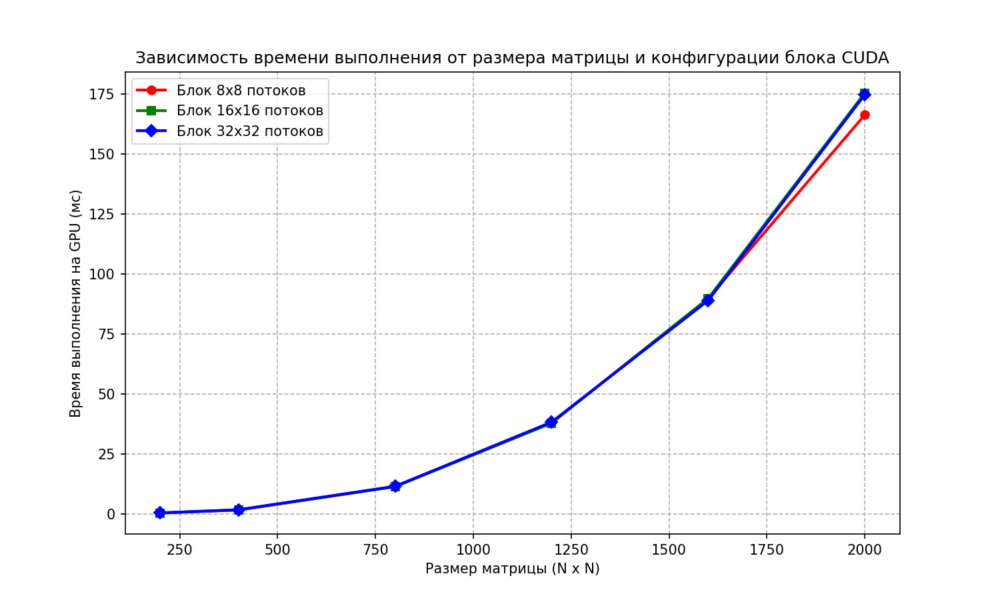

# Лабораторная работа №4. Параллельное умножение матриц с использованием CUDA

## Задание
* Модифицировать программу из лабораторной работы №1 для параллельной работы по технологии CUDA на графическом процессоре (GPU).
* Провести серию экспериментов с разными размерами матриц (200, 400, 800, 1200, 1600, 2000) и различными конфигурациями сетки блоков (размеры блоков потоков: 8x8, 16x16, 32x32).
* Построить графики зависимости времени выполнения от объема задачи и конфигурации блоков.

## Алгоритмические особенности распараллеливания на GPU
Для вычислений на видеокарте реализовано CUDA-ядро (kernel) со следующей логикой:

1. **Модель потоков (Thread Hierarchy):**
   * Результирующая матрица $C$ разбивается на двумерную сетку блоков потоков (2D Grid of Blocks).
   * Каждый поток вычисляет значение ровно **одного** элемента матрицы $C$ по формуле:
     ```cuda
     int row = blockIdx.y * blockDim.y + threadIdx.y;
     int col = blockIdx.x * blockDim.x + threadIdx.x;
     ```

2. **Управление памятью:**
   * **`cudaMalloc`** — выделение памяти в глобальной памяти видеокарты под матрицы $A$, $B$ и $C$.
   * **`cudaMemcpy(..., cudaMemcpyHostToDevice)`** — копирование исходных матриц из оперативной памяти процессора в видеопамять.
   * **`cudaMemcpy(..., cudaMemcpyDeviceToHost)`** — копирование посчитанной матрицы результата обратно на процессор после завершения расчётов.

3. **Синхронизация:**
   * Использование функции **`cudaDeviceSynchronize()`** гарантирует, что замер времени на CPU начнется строго перед запуском ядра на GPU и завершится только после того, как все тысячи потоков видеокарты полностью закончат свои вычисления.

## Результаты тестирования
Время выполнения вычислений на GPU NVIDIA GeForce RTX 3050 Laptop (в миллисекундах):

| Размер матрицы | Блок 8x8 (мс) | Блок 16x16 (мс) | Блок 32x32 (мс) |
|----------------|---------------|-----------------|-----------------|
| 200 x 200      | 0.36          | 0.33            | 0.36            |
| 400 x 400      | 1.56          | 1.61            | 1.70            |
| 800 x 800      | 11.33         | 11.33           | 11.46           |
| 1200 x 1200    | 37.86         | 37.86           | 38.25           |
| 1600 x 1600    | 89.79         | 89.81           | 88.97           |
| 2000 x 2000    | 166.33        | 175.48          | 174.77          |

## Анализ производительности
Сравним время перемножения матриц 2000 x 2000 на разных технологиях:
* Последовательный код (Л/Р 1): `3653.47 мс`
* OpenMP (8 потоков, Л/Р 2): `654.60 мс`
* MPI (8 процессов, Л/Р 3): `1638.38 мс`
* **CUDA (Блок 8x8, Л/Р 4): `166.33 мс`**

**Выводы:**
1. **Колоссальное ускорение:** Видеокарта RTX 3050 выполнила расчеты в **22 раза быстрее** последовательного CPU-кода и в **4 раза быстрее**, чем многопоточная реализация OpenMP на 8 потоках. Это наглядно демонстрирует превосходство архитектуры GPU на задачах с массовым параллелизмом.
2. **Влияние размера блока:** Конфигурации блоков `8x8` (64 потока), `16x16` (256 потоков) и `32x32` (1024 потока) показывают практически идентичные результаты. На современной архитектуре NVIDIA Ampere планировщик варпов работает максимально эффективно, а основным бутылочным горлышком алгоритма является не скорость вычислений ядер, а задержки при обращении к глобальной памяти видеокарты.



## Верификация и контроль точности
Контроль корректности выполняется Python-скриптом `gen_check.py`:
* Сопоставление с эталоном `numpy.dot()`.
* Точность сравнения: `numpy.allclose(..., atol=1e-3)`.

## Инструкция по запуску
1. **Скомпилировать CUDA-программу под архитектуру Ampere (RTX 30-серии):**
   ```bash
   nvcc -O3 -allow-unsupported-compiler -arch=sm_86 src/main.cu -o main.exe
   ```
2. **Запустить автоматическую верификацию результатов:**
   ```bash
   python scripts/gen_check.py
   ```
3. **Запустить нагрузочный тест бенчмарка:**
   ```bash
   python scripts/benchmark.py
   ```