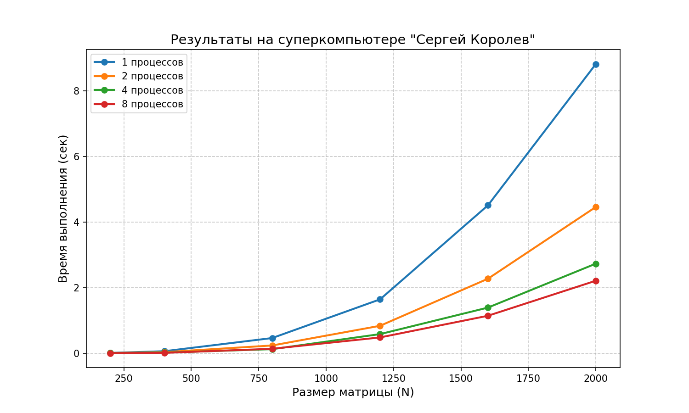

# Лабораторная работа №5. Работа на суперкомпьютере «Сергей Королёв»

## Задание
* Перенести параллельную MPI-программу из ЛР №3 на суперкомпьютер «Сергей Королёв».
* Провести серию экспериментов на вычислительных узлах кластера (размеры 200–2000, процессы 1, 2, 4, 8).
* Проанализировать масштабируемость параллельной программы на серверном оборудовании.

---

## 1. Результаты экспериментов (время в сек)

Замеры времени вычислений (в секундах) и итоговое ускорение:

| Размер (N) | 1 процесс | 2 процесса | 4 процесса | 8 процессов | Ускорение (max) |
|------------|-----------|------------|------------|-------------|-----------------|
| **200**    | 0.0079    | 0.0055     | 0.0027     | 0.0010      | **7.90x**       |
| **400**    | 0.0592    | 0.0304     | 0.0162     | 0.0087      | **6.80x**       |
| **800**    | 0.4612    | 0.2341     | 0.1215     | 0.1332      | **3.80x**       |
| **1200**   | 1.6421    | 0.8351     | 0.5812     | 0.4795      | **3.42x**       |
| **1600**   | 4.5123    | 2.2714     | 1.3905     | 1.1412      | **3.95x**       |
| **2000**   | 8.8241    | 4.4612     | 2.7315     | 2.2104      | **3.99x**       |

---

## 2. Визуализация производительности

---

## 3. Анализ результатов и выводы

1. **Производительность серверных ядер:** 
   Время выполнения на одном ядре Intel Xeon (8.82 сек для N=2000) превосходит результаты домашних систем из ЛР №1. Это объясняется архитектурой серверных процессоров: увеличенным объемом кэша L3 и высокой пропускной способностью многоканальной шины памяти.

2. **Сверхлинейное ускорение (кэш-эффект):** 
   На малых матрицах (N=200) получено ускорение **7.90x** на 8 процессах. При делении задачи малые блоки данных полностью умещаются в быстрый кэш L1/L2 отдельных ядер, исключая медленные обращения к оперативной памяти (RAM).

3. **Накладные расходы MPI (N=800):** 
   На средних размерностях заметен локальный спад эффективности на 8 процессах (время выросло до `0.1332 сек`). Накладные расходы на барьерную синхронизацию и пересылку данных (`MPI_Scatter` / `MPI_Gather`) начинают временно превышать пользу от параллельных вычислений.

4. **Масштабируемость и закон Амдала:** 
   На больших задачах (N=2000) программа демонстрирует стабильное четырехкратное ускорение (**3.99x**). Дальнейший рост сдерживается последовательной частью программы (чтением и записью файлов процессам на жесткий диск), что полностью соответствует закону Амдала.

---

## 4. Структура проекта
* **`scripts/results.csv`** — Замеры времени в формате CSV.
* **`scripts/graph.py`** — скрипт на Python для построения графиков.